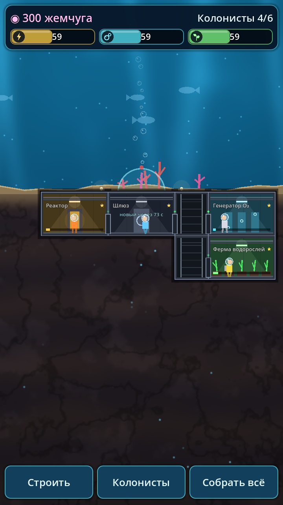
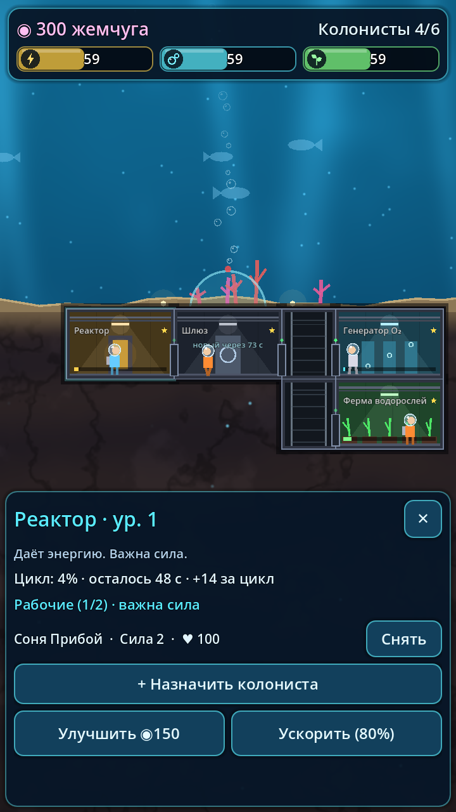
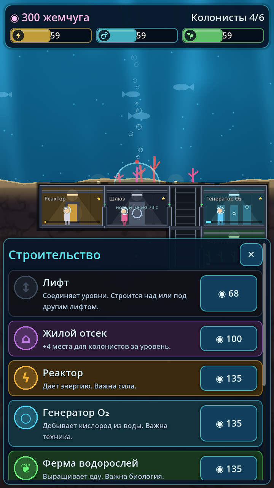
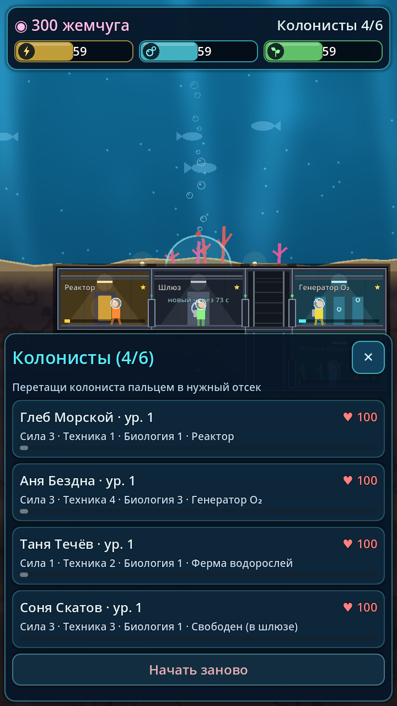

# Глубина

Мобильная игра (Android / iOS) — симулятор подводной колонии в разрезе, в духе Fallout Shelter.
Строй отсеки на дне океана, распределяй колонистов, следи за энергией, кислородом и едой, опускайся всё глубже.

<p>




</p>

## Что уже есть (прототип)

- База в разрезе: вода с рыбами и лучами света, морское дно, скала (шейдеры), отсеки с анимацией.
- Ресурсы: энергия, кислород, еда + валюта **жемчуг**.
- Отсеки: шлюз, лифт, жилой отсек, реактор, генератор O₂, ферма водорослей, склад, жемчужная ферма, медотсек.
  Открываются по мере роста колонии, улучшаются до 3 уровня.
- Колонисты с характеристиками (сила / техника / биология), здоровьем и уровнями.
  Назначение перетаскиванием пальцем или через карточку отсека.
- Производство циклами: готовый отсек показывает пузырь — нажми, чтобы собрать.
- «Ускорить» — мгновенно завершить цикл с риском аварии (пробоина).
- Новые колонисты прибывают через шлюз, пока есть места.
- Автосохранение и офлайн-прогресс (до 8 часов).
- Управление: перетаскивание — камера, щипок / колесо — масштаб.

## Запуск

1. Установи [Godot 4.3+](https://godotengine.org/download).
2. Открой папку проекта в Godot (Import → `project.godot`) и нажми ▶.

Тесты логики:

```sh
godot --headless --path . --script res://tests/run_tests.gd
```

Скриншот для разработки: `godot --path . -- --screenshot=out.png --scene=build|room|colonists|deep`.

## Сборка под телефоны

- **Android:** Editor → Manage Export Templates → установить; Project → Export → Android (нужен Android SDK и keystore).
- **iOS:** Project → Export → iOS, затем собрать сгенерированный Xcode-проект на Mac.

## Структура

| Файл | Что внутри |
|---|---|
| `scripts/defs.gd` | Данные: типы отсеков, ресурсы, имена |
| `scripts/game_state.gd` | Автозагрузка `Game`: симуляция, действия, сохранения |
| `scripts/base_view.gd` | Отрисовка колонии, колонисты, касания и камера |
| `scripts/hud.gd` | Интерфейс |
| `scripts/icons.gd` | Векторные иконки ресурсов |
| `shaders/` | Океан и скальная порода |

## Дальше по плану

Экспедиции на батискафе, случайные события (протечки, чудовища), дерево исследований,
глубинные уровни с бонусами, редкая валюта, задания, звук и музыка, настоящие арт-ассеты.
