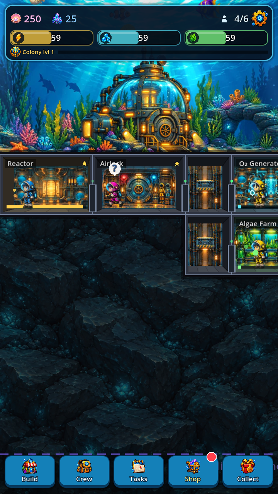
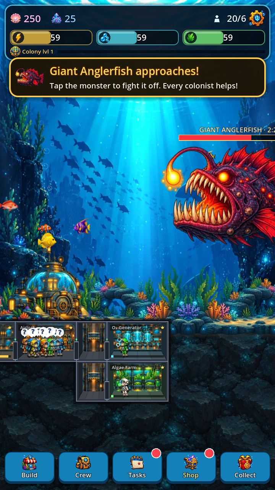
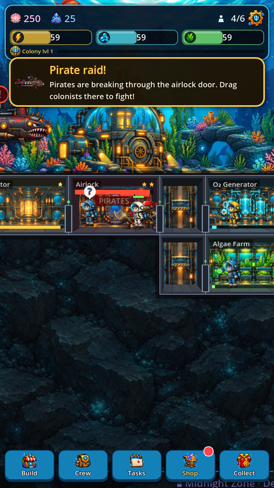
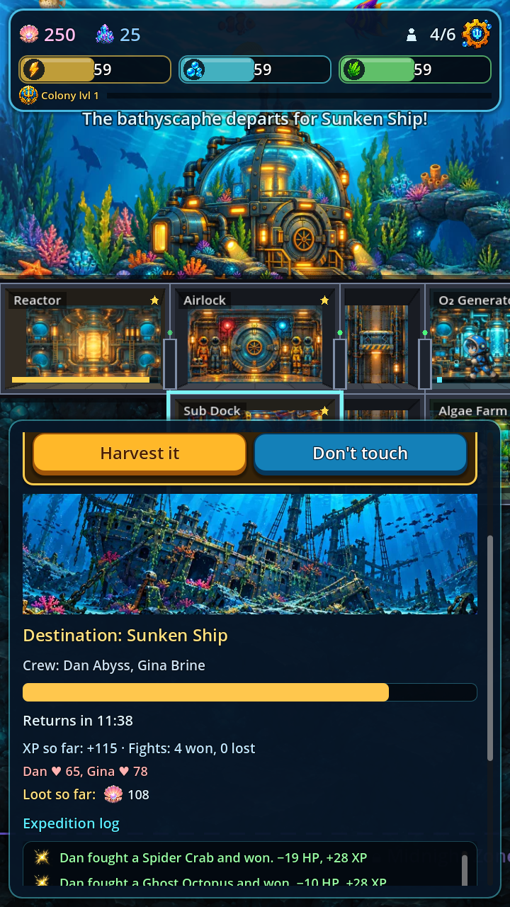
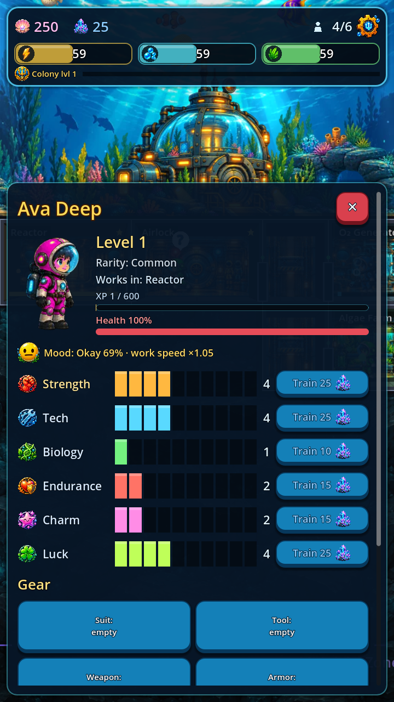
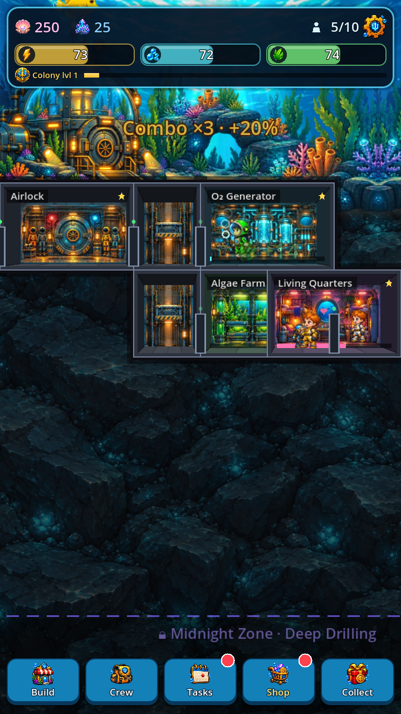
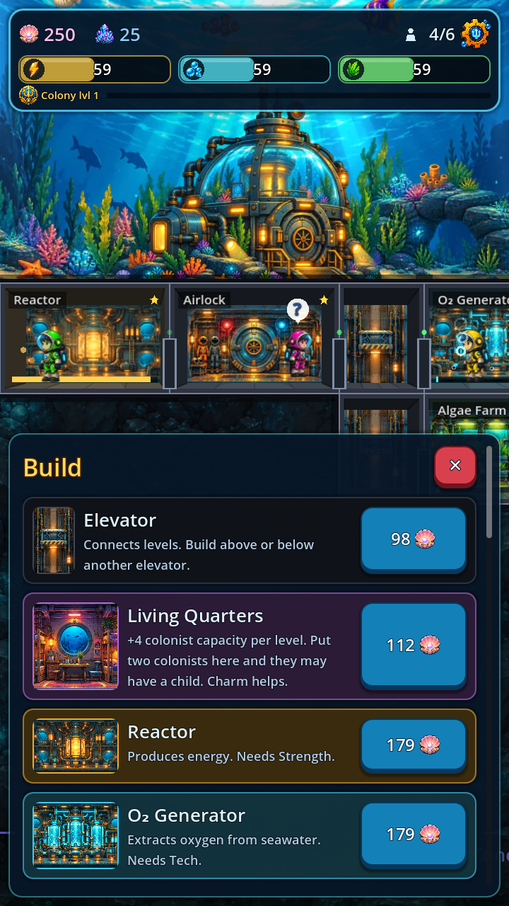
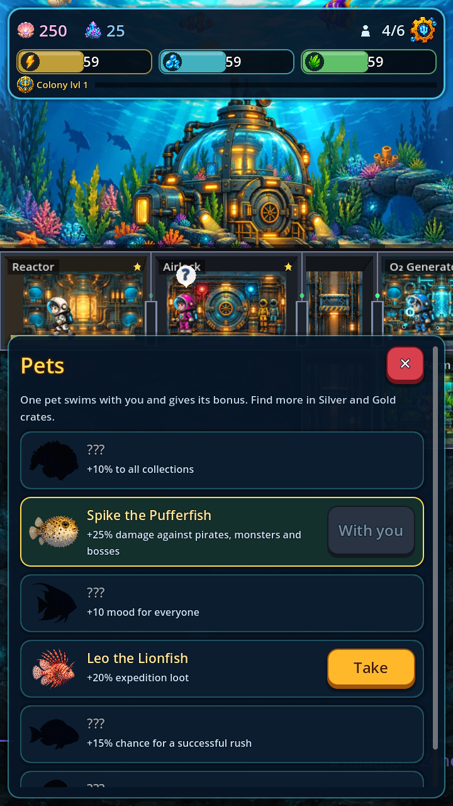
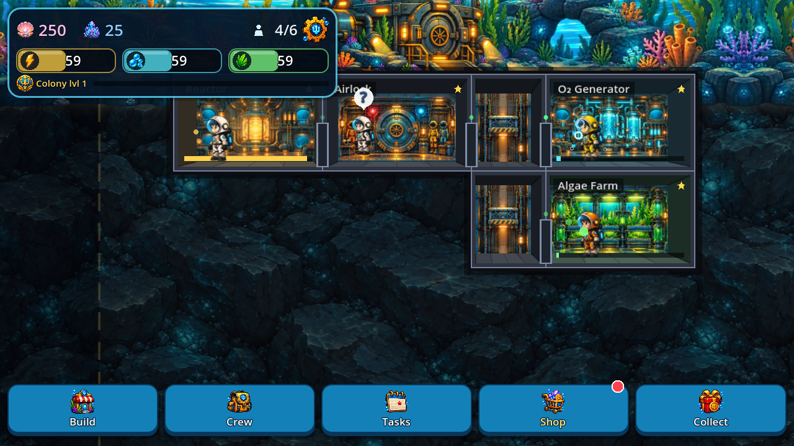

# Deep Colony

A cosy-but-dangerous **underwater colony builder** for Android and iOS, inspired by *Fallout Shelter*.
Dig rooms into the sea floor, keep your colonists breathing, fed and happy, fight off pirates and
deep-sea monsters, send expeditions into the abyss — and go ever deeper.

Built with **Godot 4.3** (GDScript). English by default, 10 languages in total.

**Download the latest test build:** [DeepColony-0.12.apk](https://raw.githubusercontent.com/born2hate/newgame/claude/kind-noether-3q5ia8/releases/DeepColony-0.12.apk) · [What's new](CHANGELOG.md)

<p>




</p>
<p>




</p>



More screens: **[full gallery](docs/SCREENSHOTS.md)**.

## Gameplay

### Build the colony
- A cross-section base on the ocean floor, 14 columns wide and 14 floors deep.
- **20 room types**: Airlock, Elevator, Living Quarters, Reactor, O₂ Generator, Algae Farm, Storage, Pearl Farm, Sub Dock, Research Lab, Medbay, Kitchen, Gym, School, Radio Room, Lounge, Workshop, Armory, Aquarium, Current Turbine, Observation Deck.
- Rooms unlock as the colony grows, upgrade to level 3, and merge with an identical neighbour into a wider room.
- **Depth zones**: Twilight Shelf → Midnight Zone → The Abyss. Deeper floors produce more and drop crystals, but incidents are more frequent and nastier. Each zone is unlocked by research.

### Colonists
- Six stats: **Strength, Tech, Biology, Endurance, Charm, Luck**, plus **Mood** that changes work speed.
- Drag a colonist into a room to assign them; they work at their stations with little animations.
- XP and levels, training rooms (Gym, School, Lounge), crystal training.
- **Gear**: suits, tools, weapons and armor in common / rare / legendary rarity.
- **Children**: a couple in Living Quarters may have a child who grows into a new colonist.
- Colonists take their helmets off when they relax.
- After 8 colonists, newcomers arrive only through the **Radio Room**.

### Danger
- **Incidents**: fires, floods and monster attacks. Send colonists to fight them — or watch them spread to other rooms and burn out, leaving the room damaged.
- **Pirate raids**: raiders break through the airlock door and loot room by room.
- **Deep bosses**: Giant Anglerfish, Kraken, Sea Serpent and Titan Crab appear above the dome — tap to fight.
- **Death and revival**: fallen colonists can be revived for pearls for a limited time.
- Three difficulty modes: **Calm**, **Normal**, **Survival**.

### Adventure and progression
- **Expeditions** by bathyscaphe to 5 zones, with a live log of fights and finds and choices to make on the way.
- **Research tree** (17 projects), **story** with Commander Reyes (20 chapters), **achievements**, **daily quests**, **weekly event**, **season pass**.
- **Colony level**, **combo collecting**, **pets** with bonuses, a **wandering trader**, treasure bubbles.
- **Colony stats** screen.

### Monetisation (test mode)
Crystals, crates, Starter Pack, Premium, No Ads, Season Pass; rewarded ads (max 12 per day). All purchases are free in the test build.

## Project layout

| Path | What it is |
|---|---|
| `scripts/game_state.gd` | The whole simulation: rooms, colonists, economy, incidents, raids, bosses, expeditions, saving |
| `scripts/defs.gd` | Static data: rooms, items, zones, research, story, quests, pets |
| `scripts/base_view.gd` | Drawing the base and handling touch input |
| `scripts/hud.gd`, `scripts/hud_more.gd` | All menus and UI (built in code) |
| `scripts/tutorial.gd` | First-time tutorial |
| `scripts/store.gd` | Shop, purchases and rewarded ads (stubbed in test mode) |
| `i18n/` | Translations; edit `i18n/src/*.txt` and run `python3 tools/build_i18n.py` |
| `art/` | All artwork; missing files fall back to code-drawn placeholders |
| `docs/ART_PROMPTS.md` | Prompts used to generate the art |
| `tests/run_tests.gd` | Logic tests |
| `scripts/selftest.gd` | Automated UI test that taps through the whole game |
| `tools/economy_sim.gd` | Bot that plays a week to check the economy |

## Running and testing

```bash
# open in the Godot 4.3 editor, or run directly:
godot --path .

# logic tests
godot --headless --path . --script res://tests/run_tests.gd

# automated UI test (portrait or landscape, any language)
godot --path . --resolution 720x1280 -- --selftest --lang=en

# economy simulation: free / ads / starter, number of days
godot --headless --path . --script res://tools/economy_sim.gd -- free 14

# screenshot of any dev scene
godot --path . --resolution 720x1280 -- --screenshot=out.png --scene=boss_ru --force-lang=en
```

## Languages
English, Russian, Spanish, Portuguese (Brazil), German, French, Italian, Turkish, Polish, Indonesian.
